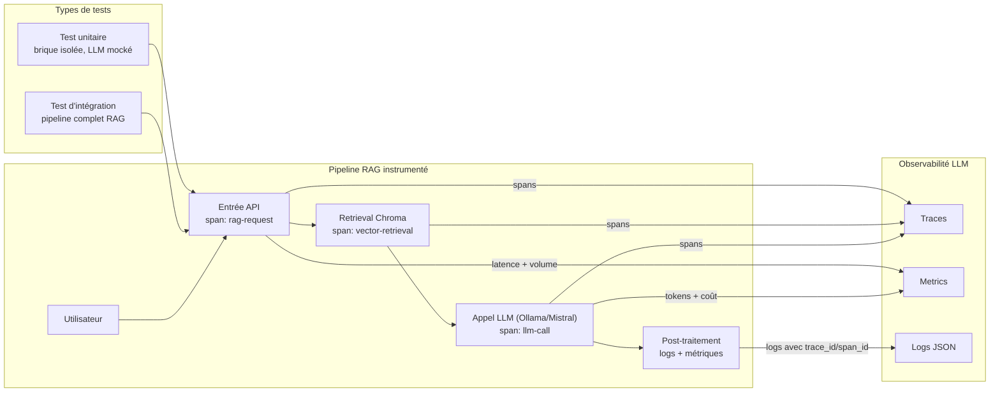
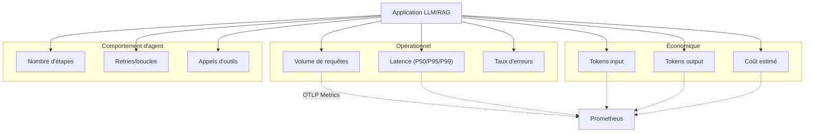
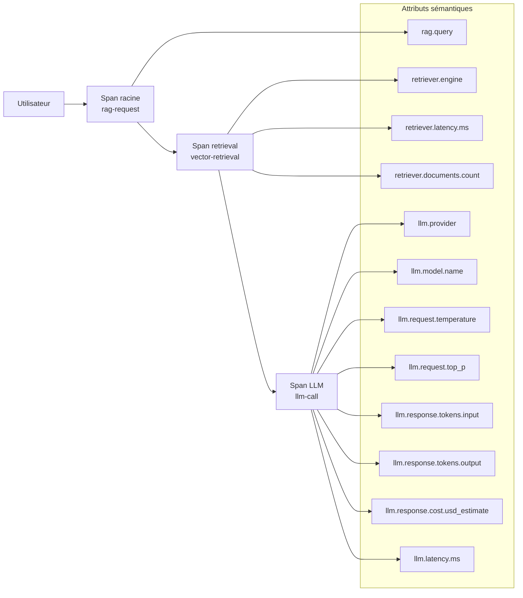
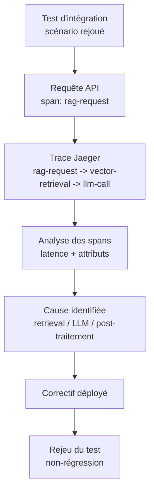
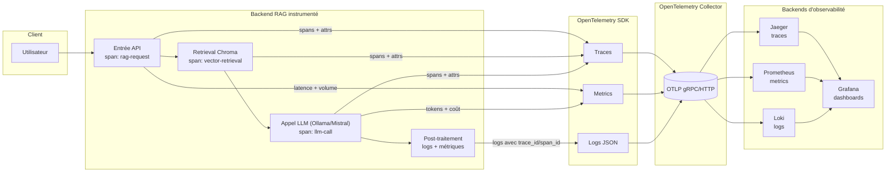

## Objet du document

Ce document répond aux cinq questions du brief Mardik en s'appuyant sur l'article **LLM Observability with OpenTelemetry: A Practical Guide** de Kartik Dudeja (Medium, 2025).
Il transpose le pipeline RAG instrumenté dans l'article (Ollama + LangChain + Chroma + OpenTelemetry + Jaeger/Prometheus/Loki/Grafana) dans une note de conception orientée agents LLM.

---

## 1. Test d'intégration pour un agent (vs unitaire) et observation d'une application IA

### 1.1. Test unitaire d'agent

Un **test unitaire d'agent** porte sur une brique isolée de la logique, sans appeler réellement le modèle :

- construction ou transformation d'un prompt à partir d'un template ;
- sélection d'un outil ou d'un sous-agent ;
- parsing et validation de la réponse (schéma, champs requis) ;
- fonctions de décision élémentaires (choix de l'étape suivante, stratégie de retry).

Dans ce contexte, le fournisseur LLM est mocké : l'article Medium rappelle que le véritable enjeu de l'observabilité LLM n'est pas la syntaxe d'une réponse, mais la **suite d'étapes qui y conduit**, ce que le test unitaire ne couvre pas.

### 1.2. Test d'intégration pour un agent

Un **test d'intégration pour un agent** exerce, lui, l'ensemble du pipeline de bout en bout :

```text
entrée utilisateur -> orchestrateur -> retrieval (Chroma)
                   -> construction de prompt -> appel LLM (Ollama/Mistral)
                   -> post-traitement -> réponse
```

Les invariants vérifiés sont de quatre ordres :

- **enchaînement** : les étapes se succèdent dans l'ordre attendu (span `rag-request`, puis `vector-retrieval`, puis `llm-call` dans Jaeger) ;
- **contrat** : la réponse respecte le format attendu (parsing possible, champs présents) ;
- **ressources** : la latence et la consommation de tokens restent sous les seuils (métriques OTel exportées vers Prometheus) ;
- **métier** : le contenu de la réponse est cohérent avec les règles applicables.

La différence clé par rapport au test unitaire est que le test d'intégration **utilise les vrais composants** (retriever, LLM, vecteur DB, observabilité) au moins lors de l'enregistrement des sessions, puis s'appuie sur des traces pour diagnostiquer les échecs.

### 1.3. Observer une application IA

Observer une application IA revient à transformer le pipeline LLM/RAG en **glass box** :

- chaque requête utilisateur correspond à une trace unique ;
- chaque étape (retrieval, LLM, post-traitement) est un span ;
- des métriques agrégées mesurent le trafic, la latence et les tokens ;
- des logs structurés capturent prompts, réponses et erreurs, corrélés aux traces par `trace_id`.

Dans l'article, l'application RAG est instrumentée pour envoyer traces, métriques et logs via OpenTelemetry vers un Collector, qui les route ensuite vers **Jaeger (traces), Prometheus (métriques), Loki (logs)**, avec **Grafana** comme interface de visualisation.

### 1.4. Schéma Mermaid – test unitaire vs intégration et glass box



#### Lecture du schéma

Le schéma oppose le test unitaire et le test d'intégration :

- le **test unitaire** cible une brique individuelle du pipeline, sans appeler réellement le modèle ;
- le **test d'intégration** traverse le pipeline complet RAG et utilise l'observabilité pour vérifier l'enchaînement, le contrat, les ressources et le métier.

La partie droite illustre le passage à la **glass box** : l'entrée API, le retrieval et l'appel LLM deviennent des spans, des métriques et des logs, ce qui permet de comprendre pour chaque requête comment la réponse a été produite.

---

## 2. Métriques révélant la santé de l'application

### 2.1. Trois familles de métriques

L'article Medium retient quatre grandes métriques, qui se répartissent dans tes trois familles classiques (opérationnelle, économique, comportementale) :

- **Request Volume** : compteur de requêtes entrantes, par fonctionnalité ou service ;
- **Request Duration** : histogramme de latence, qui permet de suivre P50/P95/P99 ;
- **Token Counters** : tokens en entrée et en sortie, ventilés par modèle ;
- **Cost** : coût estimé par requête ou par session, dérivé des tokens et de la tarification.

Ces métriques sont instrumentées via l'API Metrics d'OpenTelemetry, exportées en OTLP vers le Collector, puis mises à disposition de **Prometheus** pour l'agrégation et de **Grafana** pour les tableaux de bord.

### 2.2. Schéma Mermaid – familles de métriques



#### Lecture du schéma

Le schéma regroupe les métriques définies dans l'article Medium en trois familles :

- métriques **opérationnelles** (volume, latence, erreurs) ;
- métriques **économiques** (tokens et coût) ;
- métriques de **comportement d'agent** (nombre d'étapes, retries, appels d'outils).

Toutes ces métriques sont dérivées de l'application LLM/RAG et exportées via OpenTelemetry Metrics vers Prometheus, ce qui permet à Grafana de suivre la santé du système dans le temps.

---

## 3. Points à instrumenter pour rendre une trace exploitable

### 3.1. Spans et attributs clés

L'article introduit une cartographie minimale mais suffisante pour un pipeline RAG :

- **Span racine** : `rag-request`, qui représente la requête utilisateur ;
- **Span de retrieval** : `vector-retrieval`, pour la récupération dans Chroma ;
- **Span LLM** : `llm-call`, pour l'appel à Ollama/Mistral.

Chaque span porte des attributs sémantiques standardisés :

- `rag.query` pour la question utilisateur ;
- `retriever.engine`, `retriever.latency.ms`, `retriever.documents.count` pour la récupération ;
- `llm.provider`, `llm.model.name`, `llm.request.temperature`, `llm.request.top_p` pour l'appel modèle ;
- `llm.response.tokens.input`, `llm.response.tokens.output`, `llm.response.cost.usd_estimate`, `llm.latency.ms` pour la réponse.

### 3.2. Schéma Mermaid – cartographie des spans



#### Lecture du schéma

Ce schéma montre les **points d'instrumentation** nécessaires pour rendre une trace exploitable :

- la requête utilisateur entre par le span racine `rag-request` ;
- la récupération et l'appel LLM sont des spans distincts, avec leurs attributs ;
- chaque attribut sémantique décrit un aspect de la requête (contenu, moteur, latence, tokens, coût).

Une trace où ces spans et attributs sont présents peut être parcourue de bout en bout pour diagnostiquer une défaillance : il devient possible de trancher entre une cause côté retrieval, côté modèle ou côté post-traitement.

---

## 4. Relier un test d'intégration échoué à une cause via les traces

### 4.1. Associer chaque test à un `trace_id`

Pour relier un test d'intégration échoué à une cause, il faut que chaque exécution de scénario soit **tracée comme une requête utilisateur réelle** :

- le test lance une requête vers l'API ;
- l'API crée un span racine `rag-request` ;
- le test récupère le `trace_id` de la requête (par log, par header HTTP ou via l'API de tracing) ;
- ce `trace_id` est journalisé avec le résultat du test.

### 4.2. Schéma Mermaid – boucle test → trace → cause → correctif



#### Lecture du schéma

Le schéma formalise la **boucle de remédiation** :

1. un test d'intégration rejoue un scénario et produit une trace Jaeger ;
2. la trace est analysée span par span pour isoler la couche fautive ;
3. la cause est corrigée, puis le test est rejoué pour vérifier la non-régression.

L'utilisation de `trace_id` comme lien entre le test et la trace est l'élément clé : sans ce lien, un test échoué reste une information locale, impossible à relier à un chemin d'exécution concret.

---

## 5. Schéma d'observabilité (points de trace + métriques)

### 5.1. Schéma Mermaid – stack d'observabilité OTel



#### Lecture du schéma

Ce schéma reprend la stack complète proposée dans l'article Medium :

- l'**SDK OpenTelemetry** instrumente le backend RAG et produit trois signaux : traces, métriques, logs JSON ;
- le **Collector** reçoit ces signaux en OTLP (gRPC/HTTP) et les route vers Jaeger (traces), Prometheus (métriques) et Loki (logs) ;
- **Grafana** consomme ces trois backends pour présenter une vue unifiée de la santé de l'application.

Les points de trace (`rag-request`, `vector-retrieval`, `llm-call`) et les métriques (volume, latence, tokens, coût) sont ainsi remontés dans un seul schéma d'observabilité, qui répond directement au livrable demandé par le brief.
