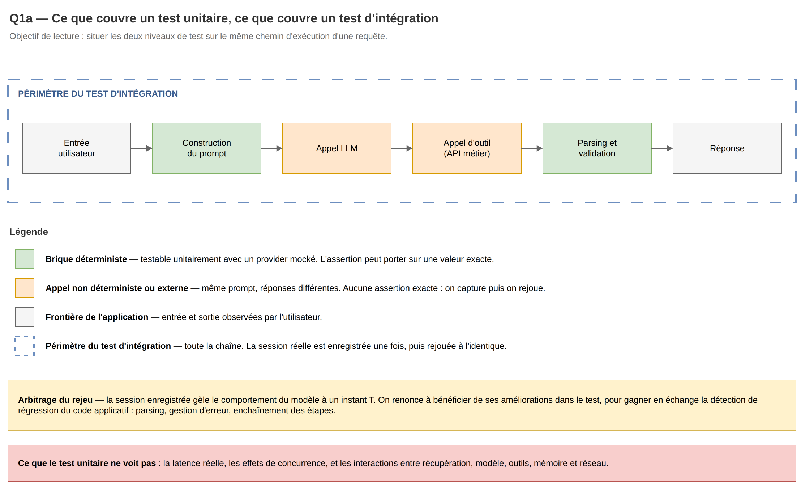
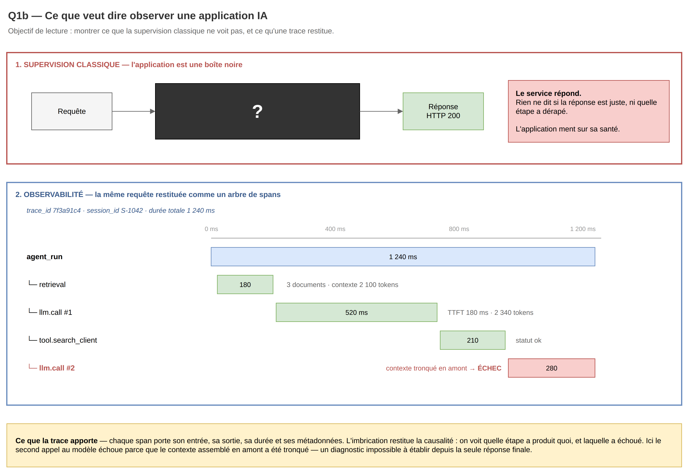
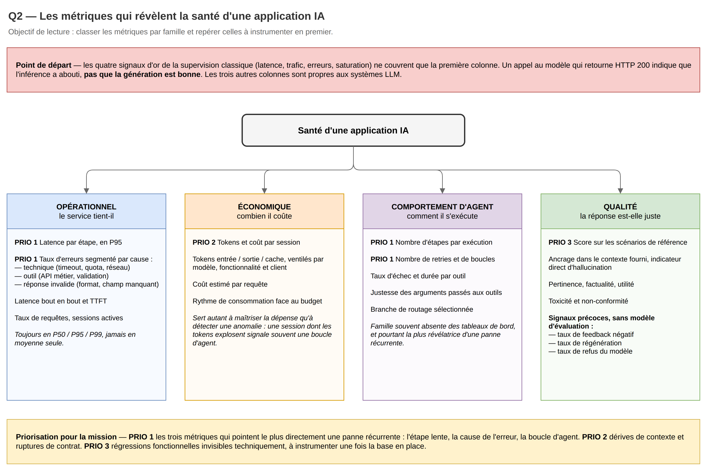
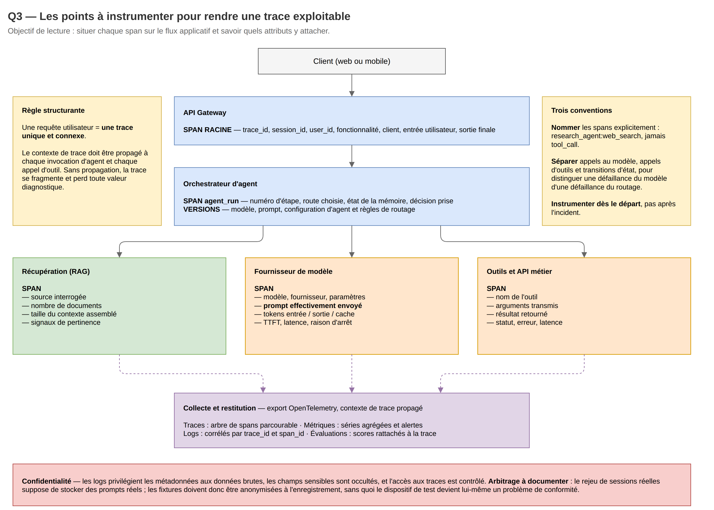
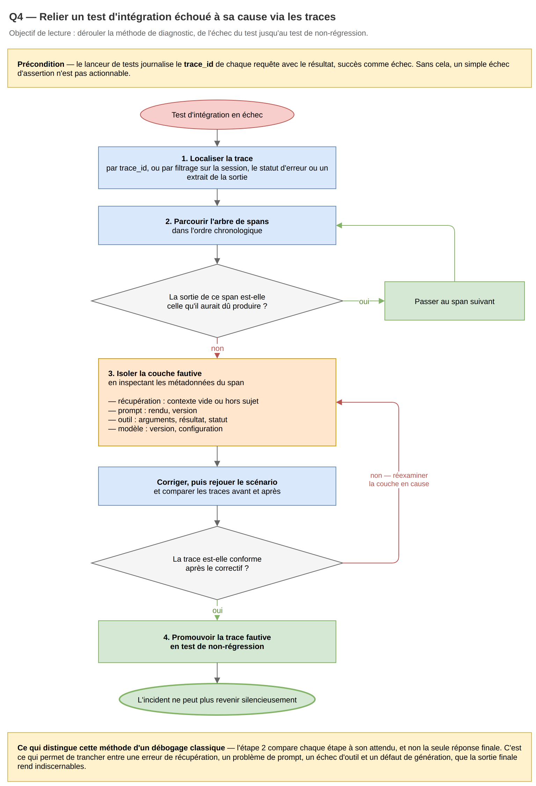
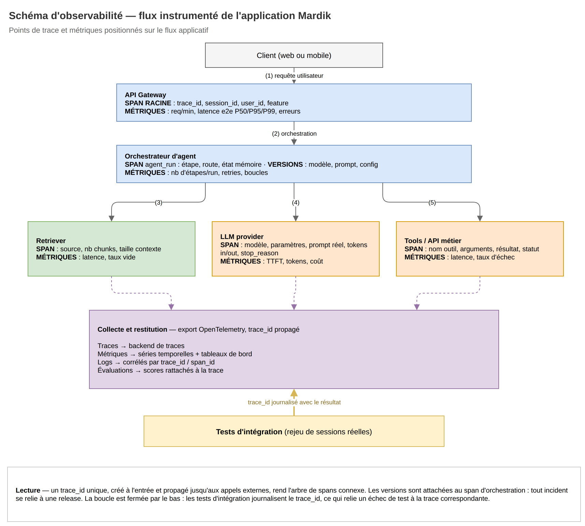

## Objet et statut du document

Ce document constitue le **livrable de conception** attendu avant tout développement : il fixe le cadre conceptuel, la stratégie d'observabilité et le plan de tests d'intégration pour l'application Mardik.

Il fusionne et arbitre les deux travaux de recherche préliminaires du binôme (`reponse_david.md` et `reponse_sofiane.md`), conservés comme documents de travail.

### Périmètre couvert

- Réponses argumentées et sourcées aux quatre questions préliminaires du brief, chacune illustrée par un schéma draw.io placé dans `images/`.
- Schéma d'observabilité : points de trace et métriques positionnés sur le flux applicatif.
- Hypothèses de causes à investiguer, et méthode pour les confirmer.
- Plan d'action outillé et priorisé sur la durée de la mission.

### Ce qui reste à ancrer sur le code réel

Ce document est volontairement explicite sur son statut : **aucune analyse du dépôt Mardik n'a encore été menée**. Les causes de panne énoncées plus loin sont donc des **hypothèses de travail**, pas un diagnostic établi.

Ce choix n'est pas une facilité, il est méthodologique. La compétence visée C3 demande d'adopter une **démarche inductive** : partir des faits observés (incidents réels, traces, sessions rejouées) pour remonter aux causes, et non plaquer un catalogue de causes théoriques sur une application que l'on n'a pas encore instrumentée. Le cadre posé ici sert à **rendre ces faits observables** ; le diagnostic proprement dit sera renseigné au fil des sections « Hypothèses de causes à investiguer » et du journal des incidents.

### Correspondance avec les attendus du brief

| Attendu du brief | Traité dans |
| --- | --- |
| Test d'intégration pour un agent vs unitaire | Tests d'un agent : unitaire, intégration, multi-sessions |
| Que veut dire observer une application IA | Observer une application IA |
| Métriques révélant la santé de l'application | Métriques de santé |
| Points à instrumenter pour une trace exploitable | Points d'instrumentation |
| Relier un test échoué à une cause via les traces | Du test échoué à la cause racine |
| Note de diagnostic | Contexte de la mission + Hypothèses de causes à investiguer + Plan d'action |
| Schéma d'observabilité | Schéma d'observabilité |
| Article d'ingénierie sur l'observabilité LLM | Article d'ingénierie de référence |

---

## Contexte de la mission

### Situation initiale

Un prototype d'IA fonctionne chez Mardik, mais il n'est pas industriel :

- aucun test en conditions réelles ;
- aucune visibilité sur ce qui se passe en production ;
- livraisons artisanales.

### Symptômes rapportés

L'application tombe en panne **sans qu'on sache pourquoi**, et les incidents **reviennent**. C'est la formulation la plus importante du brief : la récurrence des incidents est le symptôme d'un défaut d'outillage, pas seulement d'un défaut de code. Sans trace, chaque panne est traitée comme un cas isolé, le correctif est empirique, et rien ne garantit qu'il tient.

Le titre du sujet — « l'application qui ment sur sa santé » — désigne précisément ce piège : un système LLM peut répondre `HTTP 200` sur toute la chaîne tout en produisant des réponses fausses, tronquées ou hors sujet. La supervision technique classique le déclare en bonne santé.

### Objectif visé

Rendre l'application **diagnosticable**, en combinant deux leviers indissociables :

- des **tests d'intégration multi-sessions** rejouant des usages réels ;
- une **observabilité orientée LLM** couvrant l'ensemble du pipeline d'agent.

Le critère de réussite final est la correction vérifiée de **deux incidents récurrents au minimum**, avec des tests qui les détecteraient s'ils réapparaissaient.

---

## Tests d'un agent : unitaire, intégration, multi-sessions

### Vue d'ensemble des deux niveaux

| Critère | Test unitaire | Test d'intégration |
| --- | --- | --- |
| Cible | Une brique isolée de la logique d'agent | Un scénario complet de bout en bout |
| LLM réel | Non, provider mocké avec réponses en dur | Oui, mais capturé une fois puis rejoué |
| Ce qu'il prouve | Une logique déterministe est correcte | Les composants coopèrent dans un cas réaliste |
| Coût et volume | Rapide, nombreux | Plus lent, sélectif |
| Place | Base de la pyramide | Milieu de la pyramide |



### Ce que vérifie un test unitaire d'agent

Il porte sur une brique isolée, indépendante de l'appel au modèle :

- construction ou transformation d'un prompt à partir d'un template ;
- sélection d'un outil ou d'un sous-agent ;
- parsing et validation de la réponse (schéma, champs requis) ;
- fonctions de décision élémentaires, comme le choix de l'étape suivante ;
- comportement de retry et de backoff.

Ces tests sont indispensables et bon marché, mais ils ne captent **ni la latence réelle, ni les effets de concurrence, ni les interactions** entre retrieval, modèle, outils, mémoire et réseau. Le [Block Engineering Blog](https://engineering.block.xyz/blog/testing-pyramid-for-ai-agents) note qu'à ce niveau, « *most of these tests use mock providers that return canned responses instead of calling real models* ».

### Ce que vérifie un test d'intégration d'agent

Il exerce la chaîne complète :

```text
entrée utilisateur -> orchestrateur -> retrieval -> appel(s) LLM
                   -> appels d'outils -> post-traitement -> réponse
```

Les invariants contrôlés sont de quatre ordres :

- **enchaînement** : les étapes se succèdent dans l'ordre attendu, sans boucle ni appel inutile ;
- **contrat** : la réponse respecte le format et les champs attendus ;
- **ressources** : latence et consommation de tokens restent sous les seuils ;
- **métier** : le contenu de la réponse est cohérent avec les règles applicables.

Pour une architecture multi-agents, il faut en plus valider la **délégation** : la chaîne de communication entre agents, la correction du routage, et les comportements émergents qu'aucun agent testé seul ne révèle.

### Le problème du non-déterminisme et la réponse record and replay

C'est la difficulté propre aux agents : un même prompt peut produire des réponses différentes, **toutes syntaxiquement valides**. Comparer une sortie à une valeur figée est donc impossible en l'état.

La réponse retenue par le [Block Engineering Blog](https://engineering.block.xyz/blog/testing-pyramid-for-ai-agents) est de « *record reality once and replay it forever* » : un composant de test à deux modes.

- **Mode enregistrement** : la session réelle est jouée une fois contre les vrais modèles et les vrais serveurs d'outils, et l'intégralité de l'interaction est capturée dans une fixture (prompts, réponses, appels d'outils), indexée par empreinte de l'entrée.
- **Mode rejeu** : les tests rejouent la fixture de façon **déterministe**, sans rappeler le modèle.

L'arbitrage est explicite : on renonce à bénéficier des améliorations du modèle dans le test, pour gagner la **détection de régression**. La session enregistrée gèle le comportement à un instant T, ce qui permet de vérifier que le code applicatif — parsing, gestion d'erreur, enchaînement — traite correctement des sorties réalistes, sans dépendre de la variabilité du modèle ni de la disponibilité des services externes.

C'est exactement ce que demande le brief avec « des tests d'intégration rejouant des sessions réelles ».

### La dimension multi-sessions

Le brief insiste sur le caractère **multi-sessions**, qui ajoute trois axes aux scénarios :

- **concurrence** : plusieurs utilisateurs en parallèle, contention sur les ressources partagées, saturation des quotas du fournisseur de modèle ;
- **sessions longues** : maintien du contexte dans le temps, croissance de l'historique, dérive des caches de retrieval, troncature du contexte ;
- **étanchéité entre sessions** : absence de fuite de contexte ou de mémoire d'un utilisateur vers un autre.

Ces axes sont ceux où [Zendesk](https://zendesk.com/blog/zip1-building-realistic-multi-turn-tests-for-ai-agents) situe les défaillances réelles : les modèles gèrent correctement un appel d'outil isolé, mais échouent dès qu'une conversation comporte plusieurs tours, des clarifications ou des interruptions.

### Critères de succès par scénario

Chaque scénario rejoué est associé à des seuils explicites, sans quoi le test n'est pas un test :

- latence P95 et P99 sous un seuil défini par fonctionnalité ;
- taux d'erreurs par type (timeout, échec d'outil, réponse invalide) sous un seuil ;
- score minimal de qualité, évalué automatiquement ou par règle métier.

---

## Observer une application IA

### De la boîte noire à la glass box

Observer une application IA ne consiste pas à savoir **si** le service répond, mais à reconstituer **comment** chaque réponse a été produite.

La supervision classique répond à « le serveur est-il debout ». L'observabilité LLM répond à « quelle suite d'étapes a produit cette réponse, et laquelle a dérapé ». Concrètement, il s'agit d'instrumenter l'application pour capturer le chemin d'exécution complet : entrée utilisateur, étapes de récupération, construction du prompt, appels d'outils, sortie générée.

Sans cela, le débogage relève du « *guesswork* », selon la formule de [Langfuse](https://langfuse.com/docs/observability/overview), puisque le système est non déterministe par nature : on ne peut pas reproduire à la demande ce qu'on n'a pas enregistré.




### Les quatre piliers de l'observabilité LLM

| Pilier | Rôle | Granularité |
| --- | --- | --- |
| Traces | Arbre de spans couvrant toutes les étapes d'une requête, avec leur causalité | Par requête |
| Métriques | Latence, volume, erreurs, tokens, coûts, agrégés et alertables | Agrégée |
| Logs | Messages contextuels corrélés aux traces par identifiant | Par événement |
| Évaluations | Scores de qualité, détection d'hallucination, conformité | Par requête ou par échantillon |

Le quatrième pilier est celui qui distingue une application IA d'une application classique : sans évaluation, aucune métrique ne révèle qu'une réponse bien formée est fausse.

### La dimension sémantique, propre aux systèmes LLM

Trois objets doivent être observés en plus de la technique :

- le **contenu et la structure des prompts** réellement envoyés, et non les seuls templates ;
- la **dérive de comportement** dans le temps, provoquée par un changement de modèle, de prompt ou de données ;
- le **respect des politiques internes** : sécurité, conformité, ton, style.

---

## Métriques de santé

### Pourquoi les quatre signaux d'or ne suffisent pas

Les quatre signaux d'or de la supervision classique — latence, trafic, erreurs, saturation — restent nécessaires mais deviennent insuffisants : un appel au modèle qui retourne `HTTP 200` indique que l'inférence a abouti, **pas que la génération est bonne**.

Deux conséquences directes.

- L'« erreur » cesse d'être binaire. Elle devient une **distribution** qu'il faut échantillonner, scorer et comparer dans le temps, puisque deux réponses différentes au même prompt peuvent être toutes deux valides.
- Trois familles de contraintes se superposent, là où une application classique n'en connaît qu'une : **opérationnelle**, **économique** et **qualitative** ([Comet](https://www.comet.com/site/blog/llm-observability/)).

### Métriques opérationnelles

- Taux de requêtes, sessions actives, répartition du trafic par fonctionnalité.
- Latence mesurée à plusieurs niveaux : bout en bout, *time to first token* (TTFT), et **par étape** (retrieval, modèle, outil, post-traitement).
- Distribution de latence en P50, P95, P99, jamais la moyenne seule, qui masque les cas extrêmes.
- Taux d'erreurs **segmenté par cause**, condition pour prioriser la remédiation :
  - erreurs techniques : timeout, réseau, dépassement de quota, exception ;
  - erreurs d'outil : échec d'API métier, validation refusée ;
  - réponses invalides : format non respecté, JSON non parsable, champ requis manquant.

### Métriques économiques

- Tokens en entrée et en sortie, ventilés par modèle, par fonctionnalité et par client.
- Tokens mis en cache, dont l'évolution révèle l'efficacité du prompt.
- Coût estimé par requête et par session, et rythme de consommation face au budget.

Ces métriques servent autant à maîtriser la dépense qu'à **détecter une anomalie** : une session dont la consommation de tokens explose signale souvent une boucle d'agent ou un contexte qui n'est jamais purgé.

### Métriques comportementales d'agent

Souvent absentes des tableaux de bord, ce sont les plus révélatrices pour des pannes récurrentes ([groundcover](https://www.groundcover.com/learn/observability/ai-agent-observability)) :

- nombre d'étapes par exécution, et nombre de sous-agents activés ;
- nombre de retries et de boucles ;
- branche de routage sélectionnée ;
- fréquence, durée et taux d'échec par outil ;
- justesse et complétude des arguments passés aux outils.

### Métriques de qualité

- Scores de factualité, de pertinence et d'utilité, produits par juge LLM ou par script métier.
- Ancrage dans le contexte fourni (*faithfulness*), indicateur direct d'hallucination.
- Indicateurs de toxicité et de non-conformité.
- Taux de réussite sur le jeu de scénarios de référence.

Ce sont ces métriques qui empêchent l'application de « mentir sur sa santé ». Trois signaux **précoces** et peu coûteux méritent d'être instrumentés dès le premier jour, car ils ne demandent aucun modèle d'évaluation : le **taux de feedback négatif**, le **taux de régénération** par l'utilisateur, et le **taux de refus** du modèle.

### Synthèse des métriques retenues pour Mardik

Pour tenir la durée de la mission, la priorité va au sous-ensemble suivant :

| Priorité | Métrique | Ce qu'elle révèle |
| --- | --- | --- |
| 1 | Latence par étape, en P95 | L'étape responsable d'une lenteur ou d'un timeout |
| 1 | Taux d'erreurs segmenté par cause | La nature de l'incident, donc l'équipe concernée |
| 1 | Nombre d'étapes et de retries par exécution | Les boucles d'agent, cause classique de panne récurrente |
| 2 | Tokens et coût par session | Les dérives de contexte et les sessions anormales |
| 2 | Taux de réponses invalides | Les ruptures de contrat de format |
| 3 | Score de qualité sur les scénarios de référence | Les régressions fonctionnelles invisibles techniquement |



---

## Points d'instrumentation

### Principe directeur

Une requête utilisateur doit correspondre à **une trace unique et connexe**, du point d'entrée jusqu'au dernier appel externe. Cela impose de **propager le contexte de trace** à travers toutes les invocations d'agent et tous les appels d'outils, faute de quoi la trace se fragmente et perd sa valeur diagnostique.

Corollaire retenu par la littérature : instrumenter **les appels au modèle, les appels d'outils et les transitions d'état séparément**. C'est ce qui permet de distinguer une défaillance du modèle d'une défaillance du routage.

### Cartographie des spans

| Type de span | Attributs à capturer |
| --- | --- |
| Span racine | `trace_id`, `session_id`, `user_id`, fonctionnalité, client, entrée utilisateur, sortie finale |
| Exécution d'agent | Numéro d'étape, route choisie, état de la mémoire, décision prise |
| Appel LLM | Modèle, fournisseur, paramètres (température, `top_p`), prompt effectif, tokens entrée / sortie / cache, TTFT, latence, raison d'arrêt, statut |
| Appel d'outil | Nom de l'outil, arguments, résultat, latence, succès ou échec, erreur |
| Récupération | Source interrogée, nombre de documents, taille du contexte assemblé, signaux de pertinence |
| Routage ou décision | Branche sélectionnée, score de décision |
| Sous-agent | Identifiant de l'agent enfant, contexte délégué, statut de complétion |
| Garde-fou | Politique appliquée, résultat (autorisé, bloqué, modifié) |

### Attributs de version, pour relier un incident à une release

Chaque trace doit embarquer les versions actives au moment de l'exécution :

- version du modèle ;
- version du prompt, distincte de la version du code ;
- version de la configuration d'agent et des règles de routage.

Sans ces attributs, une régression apparue après un simple ajustement de prompt reste inexplicable. Avec eux, elle se lit immédiatement comme une corrélation entre un changement et une dégradation.

### Conventions de nommage et corrélation des logs

- **Nommer les spans explicitement** : `research_agent:web_search` plutôt que `tool_call`. Un nom générique rend les traces inexploitables dès que le volume augmente.
- **Corréler chaque log à sa trace** en y injectant `trace_id` et `span_id` en métadonnées, afin de reconstituer l'histoire détaillée d'une requête en croisant traces et logs.
- **Instrumenter dès le départ**, et non après l'incident : ajouter du tracing sur une application déjà en production est nettement plus coûteux.



### Instrumentation et confidentialité

L'observabilité ne doit pas créer un nouveau risque de fuite de données :

- privilégier les métadonnées aux données brutes dans les logs ;
- appliquer une politique d'occultation et d'anonymisation des champs sensibles ;
- contrôler les accès aux traces et aux logs.

Un arbitrage est à documenter explicitement : le rejeu de sessions réelles suppose de **stocker des prompts réels**, donc potentiellement des données utilisateur. Les fixtures de test doivent être anonymisées à l'enregistrement, sans quoi le dispositif de test devient lui-même un problème de conformité.

---

## Du test échoué à la cause racine

### Relier le test à sa trace

Un test d'intégration qui échoue en indiquant seulement « assertion failed » ne fait pas progresser le diagnostic. Le lanceur de tests doit donc :

- récupérer le `trace_id` associé à chaque requête du test ;
- **journaliser ce `trace_id` avec le résultat** du test, succès comme échec, et avec les assertions violées.

L'échec devient alors actionnable : il pointe vers une trace ouvrable dans l'outil d'observabilité.

### Méthode d'analyse en quatre étapes

Méthode formalisée par [Braintrust](https://www.braintrust.dev/articles/how-to-trace-llm-failure-root-cause) :

1. **Localiser la trace**, par `trace_id` fourni par le test, ou par filtrage sur l'identifiant de session, le statut d'erreur ou un extrait de la sortie.
2. **Parcourir l'arbre de spans dans l'ordre**, en comparant la sortie de chaque étape à celle qu'elle **aurait dû** produire — et non en jugeant sur la seule réponse finale.
3. **Isoler la couche fautive** en inspectant les métadonnées : la récupération a-t-elle rendu un contexte vide ou hors sujet, le prompt a-t-il été rendu correctement, l'outil a-t-il reçu de bons arguments, le modèle ou sa configuration ont-ils changé.
4. **Confirmer puis verrouiller** : rejouer la requête avec le correctif, et **promouvoir la trace fautive en cas de test** dans le jeu de scénarios.

L'étape 2 est celle qui distingue cette méthode d'un débogage classique : elle permet de trancher entre une erreur de récupération, un problème de prompt, un échec d'outil et un défaut de génération, alors que la sortie finale les rend indiscernables.



### Couplage avec les évaluations de qualité

Un test d'intégration peut aussi déclencher une évaluation automatique dont le score est rattaché à la trace. Il devient alors capable d'échouer pour deux raisons de nature différente :

- un **problème technique** : timeout, exception, format invalide ;
- un **problème fonctionnel** : réponse incorrecte, non ancrée, hors politique.

Dans les deux cas, la trace fournit les éléments pour remonter à la cause.

### Boucle de remédiation

Une fois le span fautif identifié, la boucle est la suivante :

1. Qualifier la cause sur l'élément incriminé : infrastructure, code, prompt, configuration d'agent ou modèle.
2. Corriger, puis rejouer le scénario.
3. **Comparer les traces avant et après** pour vérifier que l'amélioration est réelle et localisée.
4. Conserver le scénario comme test de non-régression permanent.

Cette dernière étape est la réponse directe au symptôme initial — des incidents qui reviennent. Un incident diagnostiqué mais non converti en test rejouable reviendra.

---

## Schéma d'observabilité

### Flux instrumenté

Le schéma ci-dessous positionne les points de trace et les métriques sur le flux applicatif.



### Lecture du schéma

Trois propriétés du schéma portent l'essentiel de la valeur diagnostique.

- **Un `trace_id` unique** est créé à l'entrée et propagé jusqu'aux appels externes : c'est ce qui rend l'arbre de spans connexe, donc parcourable de bout en bout.
- **Les versions sont attachées au span d'orchestration**, ce qui permet de relier tout incident à une release, un prompt ou une configuration précise.
- **La boucle est fermée par le bas** : les tests d'intégration journalisent le `trace_id`, ce qui relie un échec de test à la trace correspondante — c'est le mécanisme décrit dans « Du test échoué à la cause racine ».

---

## Hypothèses de causes à investiguer

Les hypothèses ci-dessous ne sont pas un diagnostic : elles orientent l'investigation à mener sur le dépôt et sur les premières traces collectées. Chacune est formulée de manière **falsifiable**, avec le signal qui la confirmerait ou l'écarterait.

### Hypothèses liées à l'absence de tests d'intégration

| Hypothèse | Signal de confirmation |
| --- | --- |
| Boucle d'agent sur un outil, ou retries en cascade | Nombre d'étapes par exécution anormalement élevé, tokens qui explosent sur une session |
| Concurrence mal gérée sur une ressource partagée | Erreurs apparaissant seulement sous charge parallèle, jamais en test unitaire |
| Contexte tronqué en session longue | Dégradation de qualité corrélée à la longueur de l'historique |
| Fuite de contexte entre sessions | Réponse contenant des éléments d'une autre session dans un scénario concurrent |
| Rupture de contrat de format | Taux de JSON non parsable, exceptions de parsing en aval |

### Hypothèses liées à l'absence d'observabilité

| Hypothèse | Signal de confirmation |
| --- | --- |
| Incident réel non détecté car techniquement silencieux | Écart entre taux d'erreur technique et score de qualité |
| Impossibilité de relier une panne à une release | Absence d'attributs de version dans les traces existantes |
| Dépassement de quota ou timeout du fournisseur non tracé | Erreurs génériques sans distinction de cause dans les logs |
| Récupération défaillante masquée par une réponse plausible | Taux de récupération vide, contexte non ancré dans la réponse |

### Méthode de confirmation

1. Instrumenter d'abord le minimum viable défini dans « Outillage retenu ».
2. Rejouer les sessions réelles disponibles et collecter les traces.
3. Trier les traces en échec par famille de symptômes.
4. Appliquer la méthode d'analyse en quatre étapes sur les deux familles les plus fréquentes.
5. Ne retenir comme cause qu'une hypothèse **confirmée par un span identifié**.

Le brief exige la correction de deux incidents récurrents : le tri par **fréquence** de l'étape 3 est donc le point de décision qui détermine sur quoi porter l'effort.

---

## Plan d'action

### Outillage retenu

Un arbitrage est nécessaire. L'état de l'art propose une pile complète — instrumentation OpenTelemetry, backend de traces dédié, série temporelle et tableaux de bord, agrégation de logs, plateforme d'évaluation. Déployer l'ensemble sur la durée de la mission consommerait le temps prévu pour le diagnostic, qui est l'objet réel du travail.

Le choix retenu est donc **une pile minimale suffisante**, extensible ensuite.

| Besoin | Choix pour la mission | Extension ultérieure |
| --- | --- | --- |
| Instrumentation | OpenTelemetry, pour ne pas se lier à un fournisseur | Conventions sémantiques partagées entre services |
| Traces et prompts | Une plateforme d'observabilité LLM unique, qui restitue traces, prompts, tokens et coûts | Backend de traces distribué dédié |
| Métriques et alertes | Métriques exportées depuis la même plateforme | Série temporelle et tableaux de bord dédiés |
| Logs | Logs structurés portant `trace_id` et `span_id` | Agrégation centralisée |
| Évaluations | Scripts métier et assertions dans les tests | Juge LLM sur échantillon de production |

Deux principes guident cet arbitrage : instrumenter **au bon endroit** vaut mieux qu'instrumenter partout, et une pile que le binôme ne sait pas exploiter en trois jours ne produit aucun diagnostic.

### Scénarios de tests d'intégration à couvrir

Priorisation par capacité à révéler les incidents décrits :

1. **Session nominale complète**, enregistrée puis rejouée : sert de référence et de détecteur de régression général.
2. **Session longue multi-tours**, avec clarification et changement de sujet : cible la troncature de contexte et la perte d'état.
3. **Sessions concurrentes**, plusieurs utilisateurs en parallèle : cible la contention et l'étanchéité entre sessions.
4. **Échec d'outil injecté**, indisponibilité ou réponse invalide : cible la gestion d'erreur et les retries en cascade.
5. **Scénario métier critique**, à identifier avec Mardik : cible la justesse fonctionnelle.

Chaque scénario porte les seuils définis dans « Critères de succès par scénario » et journalise son `trace_id`.

### Jalons sur trois jours

| Jour | Objectif | Vérification |
| --- | --- | --- |
| 1 | Analyse du dépôt, instrumentation minimale, premier scénario enregistré et rejoué | Une trace complète est lisible de bout en bout |
| 2 | Scénarios 2 à 4, collecte et tri des traces en échec, diagnostic des deux incidents les plus fréquents | Chaque incident est rattaché à un span identifié |
| 3 | Correctifs, rejeu comparatif avant et après, journal des incidents, finalisation des livrables | Les tests échouent avant le correctif et passent après |

Le point de contrôle du jour 3 est le seul qui prouve l'atteinte du critère de performance : un test qui passe après correction, sans avoir échoué avant, ne démontre pas qu'il détecte l'incident.

---

## Article d'ingénierie de référence

### Article retenu

**[Testing Pyramid for AI Agents](https://engineering.block.xyz/blog/testing-pyramid-for-ai-agents)**, Block Engineering Blog.

Trois raisons motivent ce choix.

- Il couvre **les deux volets** admis par le brief — observabilité et tests d'intégration — là où la plupart des ressources n'en traitent qu'un.
- C'est un **retour d'expérience d'ingénierie** sur un système réel, et non un contenu promotionnel d'éditeur d'outil.
- Il apporte le mécanisme directement réutilisable ici : le composant de test à deux modes, enregistrement puis rejeu déterministe, qui répond littéralement à l'exigence « rejouant des sessions réelles ».

### Ressources complémentaires

- **[What is LLM observability?](https://www.braintrust.dev/articles/llm-observability-guide)**, Braintrust : définition de l'observabilité LLM, distinction avec l'observabilité classique, rôle respectif du tracing, des métriques et des évaluations, avec des exemples de traces d'exécution d'agent.
- **[How to trace an LLM failure back to its root cause](https://www.braintrust.dev/articles/how-to-trace-llm-failure-root-cause)**, Braintrust : la méthode en quatre étapes reprise dans ce document.
- **[AI Agent Observability Guide](https://www.groundcover.com/learn/observability/ai-agent-observability)**, groundcover : cartographie des spans et des métriques comportementales d'agent.
- **[Building realistic multi-turn tests for AI agents](https://zendesk.com/blog/zip1-building-realistic-multi-turn-tests-for-ai-agents)**, Zendesk : conception de scénarios multi-tours réalistes.

---

## Limites du document

Trois limites sont assumées et devront être levées au cours de la mission.

- **Le dépôt Mardik n'a pas été analysé.** Les hypothèses de causes, les scénarios et les seuils devront être révisés à la lecture du code et des incidents réels.
- **Les seuils sont nommés mais pas chiffrés.** Ils ne peuvent l'être qu'après une première collecte de métriques établissant la ligne de base.
- **Le scénario métier critique reste à identifier** avec l'équipe Mardik, faute d'accès au contexte fonctionnel à ce stade.

---

## Sources

- [Testing Pyramid for AI Agents — Block Engineering Blog](https://engineering.block.xyz/blog/testing-pyramid-for-ai-agents)
- [Building realistic multi-turn tests for AI agents — Zendesk](https://zendesk.com/blog/zip1-building-realistic-multi-turn-tests-for-ai-agents)
- [LLM Observability and Application Tracing — Langfuse](https://langfuse.com/docs/observability/overview)
- [What is LLM observability? — Braintrust](https://www.braintrust.dev/articles/llm-observability-guide)
- [How to trace an LLM failure back to its root cause — Braintrust](https://www.braintrust.dev/articles/how-to-trace-llm-failure-root-cause)
- [LLM Tracing and Agent Observability — MLflow](https://mlflow.org/docs/latest/genai/tracing/)
- [What is LLM Observability? — Comet](https://www.comet.com/site/blog/llm-observability/)
- [AI Agent Observability Guide — groundcover](https://www.groundcover.com/learn/observability/ai-agent-observability)
- [Multi-Agent Tracing 2026 — FutureAGI](https://futureagi.com/blog/trace-debug-multi-agent-systems-observability-guide/)
- [Multi-turn Evaluation and Simulation — MLflow](https://mlflow.org/blog/multiturn-evaluation/)
